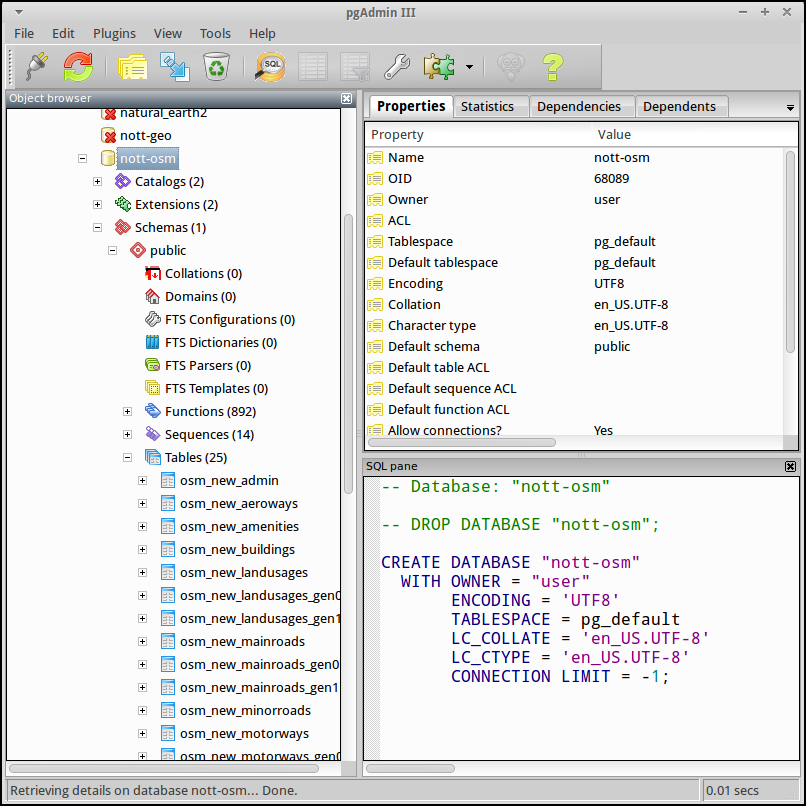
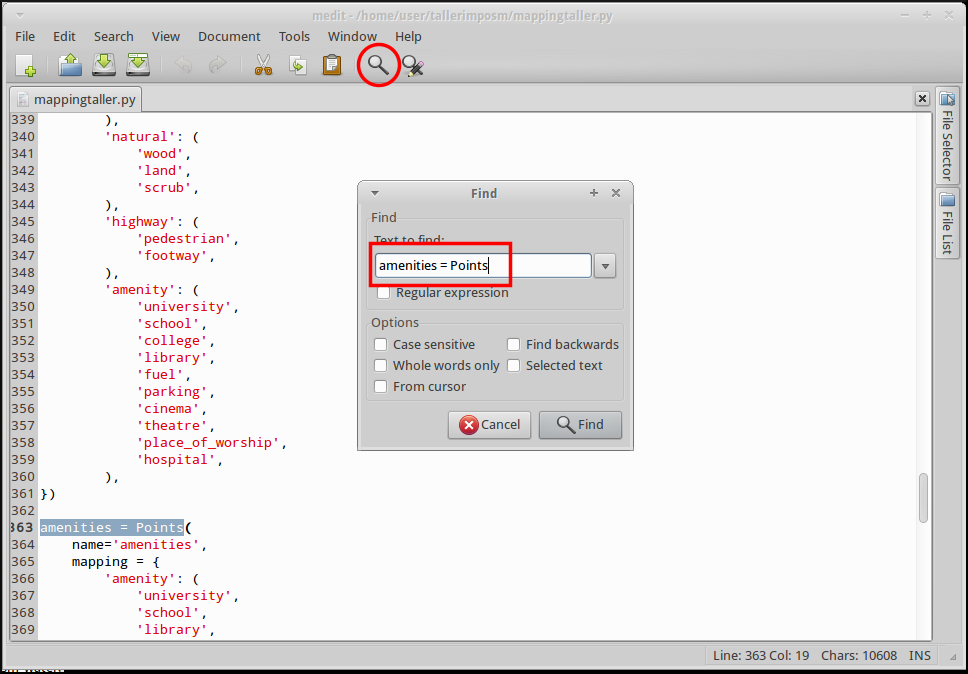

.. _imposm:

Importando datos de OSM a una base de datos PostGIS
========================================================

Qué es Imposm
---------------------

Se trata de una serie de *scripts* Python que permiten importar datos de
OpenStreetMap a una base de datos Postgres. Los archivos a importar deben
estar en el formato XML o PBF de OSM y la base de datos debe tener activada la
extensión espacial PostGIS.

Su espiritu es optimizar la creación de bases de datos geográficas enfocadas a
renderizar o a montar servicios WMS.

Los desarrolladores principales son `Omniscale <http://omniscale.com>`_, que
es la empresa de Dominik Helle y Oliver Tonnhofer, que también están detrás
del proyecto `MapProxy <http://mapproxy.org>`_.

Funciona en Linux y Mac OS X y es código libre bajo licencia `Apache Software
License 2.0 <http://www.apache.org/licenses/LICENSE-2.0.html>`_.

Características
--------------------

Esquemas de base de datos personalizados
    Crea tablas separadas para cada tipo de dato. Permite crear estilos
    ndependientes de manera sencilla y mejora el rendimiento de renderización.

Soporte para Multiples CPUs
    Está pensado para usar procesos paralelos de manera que distribuye la
    carga de trabajo entre los CPUs y núcleos del equipo.

Normaliza valores
    Por ejemplo, todos los posibles valores boleanos ``1``, ``on``, ``true`` y ``yes``
    se convierten en ``TRUE``.

Soporte para localización de cadenas de texto
    Busqueda personalizable de valores localizados

Filtro por etiqueta o por valor
    La importación es selectiva y configurable

Cache eficiente de nodos
    Para almacenar las calles y las relaciones es necesario almacenar todos los nodos.
    Imposm usa la base de datos basada en archivo
    `Tokyo Cabinet <http://fallabs.com/tokyocabinet/>`_ que almacena pares clave
    valor para hacer una *cache* de estos datos. Así se reduce de manera significativa
    el uso de la memoria.

Tablas generalizadas
    Se pueden crear automáticamente tablas con menor resolución espacial, lo que permite por ejemplo preparar rápidamente renders de grandes redes a bajas resoluciones

Vistas de uniones
    Permite crear vistas que combinen distintas tablas. Por ejemplo podemos disponer
    de la cartografía de carreteras separada en tablas para autopistas, carreteras
    principales y calles, pero también una vista que integre todas estas tablas.

Limitaciones
---------------

No permite el uso de actualizaciones diferenciales

Solo permite el uso de bases de datos PostGIS, aunque podría implementarse con
facilidad su uso con otras como SpatialLite, Oracle, etc.

Aunque es bastante eficiente con el uso de la memoria, las importaciones de
datos masivas pueden llevar bastante tiempo: un archivo de 1 GB (comprimido,
equivalente a Alemania) en un sistema con 2 GB RAM o Europa entera (~5 GB) en
un sistema de 8 GB no darían problemas, pero un planet requerirá de unos 16 GB
de RAM o más (tarda unas 20h con 8GB).

Ejercicio
------------

A continuación se detalla una práctica guiada en la que se verán los detalles
básicos del manejo de la aplicación Imposm.

Se espera del lector que vaya ejecutando las instrucciones que se detallan a
continuación y en caso de duda pregunte al facilitador.

.. important:: El entorno de trabajo que se supone para esta práctica es OSGeo Live 7.0.

Para trabajar lo primero que vamos a hacer es crear la carpeta en la que
trabajaremos. Abrimos una terminal y cambiamos al directorio tecleando

.. code-block:: bash

    $ cd ~

Creamos un nuevo directorio y accedemos al mismo

.. code-block:: bash

    $ mkdir tallerimposm
    $ cd tallerimposm

Instalación
------------------

Lo primero es instalar algunas dependencias del sistema (es probable que ya tengamos
instaladas algunas de ellas):

.. code-block:: bash

  $ sudo apt-get install build-essential python-dev protobuf-compiler \
                      libprotobuf-dev libtokyocabinet-dev python-psycopg2 \
                      libgeos-c1 libgdal1-dev libspatialindex-dev \
                      python-virtualenv tree

El siguiente paso depende de si nuestra máquina tiene acceso a Internet por el
puerto 443 y por tanto podemos instalar paquetes con ``pip`` o no. En el
segundo caso se ofrece un entorno virtual ya funcional para descarga.

Si podemos instalar paquetes en el entorno virtual
++++++++++++++++++++++++++++++++++++++++++++++++++++

Crear el entorno virtual e instalar los paquetes necesarios ejecutando:

.. code-block:: bash

  $ virtualenv venv
  $ source venv/bin/activate
  (venv)$ pip install imposm rtree

Si no podemos instalar paquetes en el entorno virtual
++++++++++++++++++++++++++++++++++++++++++++++++++++++

Descargamos un
`entorno virtual ya preparado <https://docs.google.com/uc?authuser=0&id=0B28vBRfHgG9pM3JROXI0bk1YeUE&export=download>`_
y nos aseguramos de descomprimirlo en la carpeta
:file:`/home/user/tallerimposm`. Una vez descargado lo activamos con:

.. code-block:: bash

  $ source venv/bin/activate

Comprobar la versión de ``imposm``
+++++++++++++++++++++++++++++++++++++++

Para comprobar la versión de ``imposm`` ejecutamos:

.. code-block:: bash

    (venv)$ imposm --version

Y deberíamos obtener::

    Enabling Shapely speedups.
    imposm 2.5.0

Obtener el juego de datos
--------------------------

Descargamos el fichero de datos :file:`gilet.pbf`
al directorio de trabajo (disponible en el
`siguiente enlace <https://drive.google.com/file/d/0B28vBRfHgG9pVjhBTmpSMUtwZkE/edit?usp=sharing>`_).
Puedes consultar el fichero :file:`README.md`
para saber más sobre cómo se ha generado ese fichero.

.. note:: El formato ``pbf`` es un formato binario pensado para almacenar
          información de forma muy eficiente y de rápido acceso. Los ficheros
          ``pbf`` no necesitan ser comprimidos y pueden ser consumidos directamente
          tanto por ``imposm`` como por ``osmosis``, el *software* de transformación
          de datos de OSM. Puedes consultar más información en la página
          `PBF Format <https://wiki.openstreetmap.org/wiki/PBF_Format>`_ del wiki
          de OpenStreetMap.

Preparando la base de datos
------------------------------------

El primer paso para la carga de datos es la creación de la base de datos.
OSGeo Live 7.0 dispone de Posgres 9.1 con PostGIS 2.0. En esta combinación y
con la configuración de OSGeo Live es muy sencillo crear una base de datos
geográfica a la que nuestro usuario del sistema tendrá acceso. Para crear la
base de datos ``gilet`` basta con ejecutar los siguientes comandos:

.. code-block:: bash

  (venv)$ createdb -E UTF8 gilet
  (venv)$ psql -d gilet -c "create extension postgis;"

Si por alguna razón queremos borrar la base de datos basta con ejecutar:

.. code-block:: bash

  (venv)$ dropdb gilet

Primera importación
------------------------------------

Podemos proceder a la primera importación de datos que realizaremos haciendo
los tres pasos por separado:

* Lectura
* Escritura
* Optimización

Lectura
++++++++++++++++

Se realiza empleando el comando:

.. code-block:: bash

    $ imposm --read gilet.pbf

Como la cantidad de datos no es muy grande, solo tardará unos segundos. Una
vez acaba podemos comprobar que ha creado los archivos de cache listando los
archivos del directorio:

.. code-block:: bash

    $ ls

    gilet.pbf  imposm_coords.cache  imposm_nodes.cache  imposm_relations.cache  imposm_ways.cache  venv

Imposm ha generado los archivos :file:`.cache` que son archivos binarios con los
datos preparados para ser incluidos en la base de datos.

Escritura
++++++++++++++++

Se realiza empleando el comando:

.. code-block:: bash

    (venv)$ imposm --database gilet --host localhost --user user --write

Solicitará la constraseña del usuario ``user`` y cargará los datos que hay en
los archivos :file:`.cache`.

Podemos investigar qué ha hecho Imposm lanzando la aplicación pgAdmin III que
está instalada en la máquina virtual en el menú ``Development``. Podemos
comprobar que ha creado 24 tablas nuevas, todas con el sufijo ``new_``

El esquema de tablas y qué etiquetas ha importado son los estándar ya que aún
no hemos cambiado los `mappings`. En concreto podremos encontrar:

* Amenities
* Places
* Transport_points
* Administrative polygons
* Buildings
* Landusages
* Aeroways
* Waterareas
* Roads (en realidad repartidas en varias tablas en función de la categoría)
* Railways
* Waterways

También vienen unas tablas con geometrías de las vías de transporte
generalizadas en función de dos tolerancias y unas vistas que agrupan todas
las carreteras.

Optimización
++++++++++++++++

El último paso de la carga de datos sería la optimización de los datos que se
realiza empleando el comando:

.. code-block:: bash

    (venv)$ imposm --database gilet --host localhost --user user --optimize

Todo en un paso
++++++++++++++++

En realidad los tres pasos anteriores se podrían ejecutar en un solo comando:

.. code-block:: bash

    $ imposm --database gilet --host localhost --user user  --read --write --optimize gilet.pbf

Flujo de trabajo
-----------------------

.. note:: Manten pgAdmin abierto y refresca con :kbd:`F5` para ver cómo van
          actualizándose las tablas.

Pasar a producción
+++++++++++++++++++

El flujo de trabajo recomendado permite el despliegue de las tablas
conservando hasta 3 versiones a la vez del mismo juego de datos. El despliegue
se inicia al ejecutar el comando:

.. code-block:: bash

    $ imposm --database gilet --host localhost --user user --deploy-production-tables

La importación de datos se hace sobre tablas a las que se le añade el prefijo
``osm_new_`` en el nombre. Podremos comprobar con pgAdmin III como se ha
cambiado  el nombre de todas las tablas perdiendo el prefijo **new\_**.  Si ya
hubiéramos hecho otro despliegue las actuales tablas ``osm_`` se renombrarán
automáticamente a ``osm_old_``. Cada vez que se hace un despliegue se borrarán
primero las ``osm_old_``.

Si volvemos a cargar la *cache* y a pasar a producción las tablas con:

.. code-block:: bash

    $ imposm --database gilet --host localhost --user user  --write --optimize --deploy-production-tables

veremos como las tablas que no tengan prefijo pasarán a tener el prefijo **old\_**.

Revertir el despliegue y borrar tablas temporales
++++++++++++++++++++++++++++++++++++++++++++++++++++++

Para revertir el despliegue se puede ejecutar el comando:

.. code-block:: bash

    $ imposm -d osm --recover-production-tables

Finalmente para borrar *definitivamente* las tablas marcadas con **old\_** y las
marcadas con **new\_** se emplea el comando:

.. code-block:: bash

    $ imposm --database gilet --host localhost --user user  --remove-backup-tables

Modificando el *mapping*
----------------------------------

El esquema de base de datos por defecto que utiliza Imposm viene de los
`elementos y etiquetas más comunes de OSM <http://wiki.openstreetmap.org/wiki/ES:Map_Features>`_.
Este esquema permite trasladar los datos empleando el paquete
``imposm.mapping`` y las estructuras definidas en el archivo::

    /usr/local/lib/python2.7/dist-packages/imposm/defaultmapping.py

*Tablas*
++++++++++

Hay definidas tres clases de Python para las geometrías base: ``Points``,
``LineStrings``  y ``Polygons`` y todas las tablas tienen que ser instancias
de una de ellas. Las tres clases usan los mismos argumentos:

``name``
  Nombre de la tabla (sin prefijos).

``mapping``
  El *mapping* de los pares clave/valor básicos que se meterán en la tabla.

``fields``
  El *mapping* de campos adicionales que también son pares clave/valor
  de OSM y que se convertirán en columnas de la tabla.

``field_filter``
  Filtros que permitan discriminar los datos que se introducen.

*mapping*
++++++++++

El argumento `Mapping` debe ser un diccionario (un diccionario de Python) en
la que las claves de OSM (p.e. `highway`, `leisure`, `amenity`, etc.) son las
claves del diccionario y los valores de OSM (p.e. `motorway`, `trunk`,
`primary`, etc.) los valores de las claves del diccionario.

Para una tabla de paradas de autobús, de tranvía y de ferrocarril el `mapping`
debería ser parecido a este::

  mapping = {
      'highway': (
          'bus_stop',
      ),
      'railway': (
          'station',
          'halt',
          'tram_stop',
      )
  }

*fields*
++++++++++

El argumento `fields` debe ser una lista (o una tupla) con el nombre de la
columna y su tipo de dato. Se emplea para añadir información adicional a la
tabla. Imposm tiene clases para los tipos de datos más comunes que son las
responsables de hacer sustituciones como `1`, `yes` y `true` a ``TRUE`` en
caso de datos booleanos por lo que se recomienda su uso::

  fields = (
      ('tunnel', Bool()),
      ('bridge', Bool()),
      ('oneway', Direction()),
      ('ref', String()),
      ('z_order', WayZOrder()),
  )

En el ejemplo la línea ``('tunnel', Bool())`` convertirá los valores de la
clave ``tunnel`` a valores booleanos.

Ejemplo
++++++++++

::

  towers = Points(
    name = 'towers',
    mapping = {
      'man_made': (
        'tower',
        'water_tower',
      )
    }
    fields = (
      ('height', Integer()),
    )
 )

Ampliando el esquema por defecto
+++++++++++++++++++++++++++++++++++

El esquema que carga Imposm por defecto es generalmente insuficiente ya que se
suele emplear un abanico de datos mucho más amplio.

Por ejemplo, en nuestro caso no se está incluyendo en la base de datos ningún
registro de los siguientes tipos y subtipos:

* Amenity

  * restaurant
  * pub
  * cafe
  * place of worship
  * parking

* Natural
* Tourism
* Barrier

Por lo que debemos modificar el archivo de `mapping` para que los incluya. El archivo `mapping` se encuentra en la siguiente localización:

    /usr/local/lib/python2.7/dist-packages/imposm/defaultmapping.py

lo copiamos y editamos empleando los siguientes comandos:

.. code-block:: bash

    (venv)$ cd ~/tallerimposm
    (venv)$ cp venv/lib/python2.7/site-packages/imposm/defaultmapping.py mappingtaller.py
    (venv)$ medit mappingtaller.py

Buscamos la cadena ``amenities = Points`` usando el comando buscar de `medit` pulsando en
la lupa de la barra de herramientas.

Como podemos ver, Imposm por defecto tiene determinados tipos de Amenity cuando son puntos pero no tiene ninguno de los indicados en la lista referida un par de párrafos más arriba.

Vamos a añadir al argumento `mapping` los elementos que le faltan (no importa el orden) respetando la sintaxis de tuplas de Python de forma que quede de la siguiente manera:

.. code-block:: python

    amenities = Points(
        name='amenities',
        mapping = {
            'amenity': (
                'university',
                'school',
                'library',
                'fuel',
                'hospital',
                'fire_station',
                'police',
                'townhall',
                'restaurant',
                'pub',
                'cafe',
                'place_of_worship',
                'parking',
            ),
    })

El caso de los árboles (*natural/tree*) es distinto ya que por defecto Imposm
no incluye un `mapping` para la clave `Natural`, por lo que la crearemos desde
cero, justo debajo del objeto `amenities` vamos a crear un nuevo objeto para
poder importarlos.

.. code-block:: python

    arboles = Points(
        name = 'arboles',
        mapping = {
            'natural': (
                'tree',
            ),
        },
    )

Guardamos el archivo con y salimos de `medit`.

Ejecutamos el comando para escribir y optimizar los datos en la base de datos:

.. code-block:: bash

    (venv)$ imposm --database gilet --host localhost --user user \
      --read gilet.pbf --write --optimize --deploy-production-tables \
      --overwrite-cache --remove-backup-tables -m mappingtaller.py

En este caso es necesario volver a leer los datos y generar los archivos de
cache, ya que hemos modificado la estructura de los datos. Con la opción
``--overwrite-cache`` se sobrescribirán directamente los archivos necesarios.

Ejercicio
+++++++++++

Como ejercicio del taller se propone crear el `mapping` para las claves de
farolas (``highway/street_lamp``), los postes de la luz (``power/pole``) y las
piscinas (``leisure/swimming_pool``); a continuación escribir los datos en la
base de datos y desplegar las tablas.

Referencias y enlaces
-------------------------

* `Web de Imposm <http://imposm.org>`_
* `Web de Omniscale <http://omniscale.com>`_
* `Cómo instalar un template de PostGIS <http://www.mapbender.org/Postgis_template>`_
