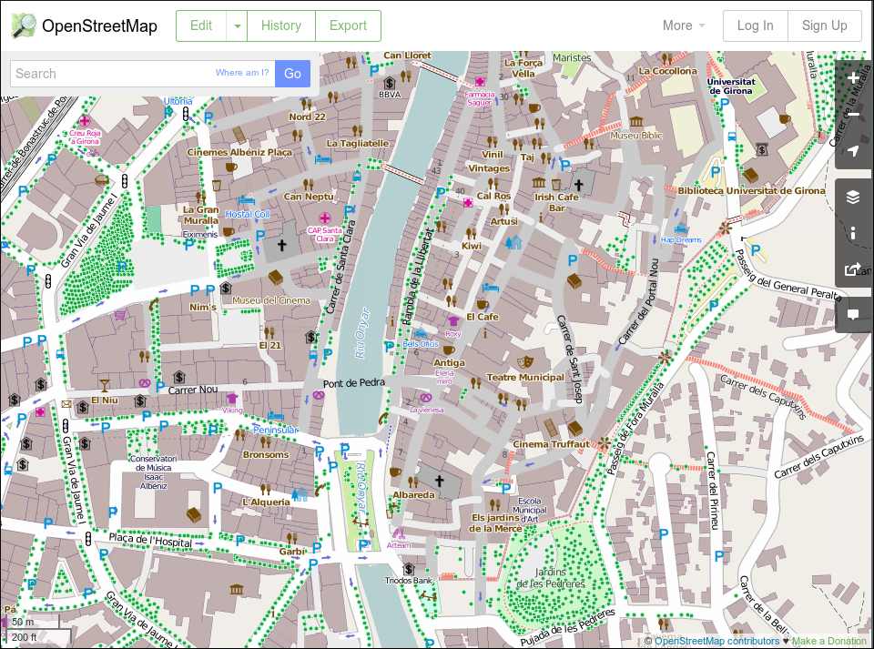
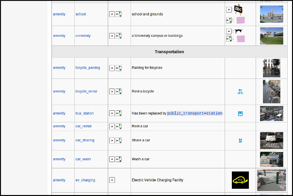

.. _osmyjosm:

OpenStreetMap, el mapa colaborativo
=====================================

Introducción a OpenStreetMap
------------------------------

OpenStreetMap (en adelante OSM) es un proyecto colaborativo para crear mapas
libres y editables. Se dice que OSM es a lo mapas, como la Wikipedia a las
enciclopedias. Actualmente hay más de 1.500.000 usuarios registrados
(estadísticas_).

La mejor definición de OSM es que se trata de una **Comunidad de usuarios**
que crea una **Base de datos colaborativa** con datos geográficos.

.. _estadísticas: http://www.openstreetmap.org/stats/data_stats.html



La página principal de OSM es http://www.openstreetmap.org/ donde puede
verse el mapa que se genera con los datos aportados por los usuarios. La
comunidad se organiza a través de una wiki cuya dirección es
http://wiki.openstreetmap.org/

El proyecto es propiedad de la Fundación OpenStreetMap, cuyo objetivo es
*«fomentar el crecimiento, desarrollo y distribución de datos geoespaciales
libres y a proveer datos geoespaciales a cualquiera para usar y compartir»*.
Los datos tienen una licencia conocida como `Open Database License 1.0
<http://www.opendatacommons.org/licenses/odbl/>`_ especialmente ideada para
publicar bases de datos.

Historia de OSM
----------------

El proyecto nace de la mano de `Steve Coast`_ en 2004 que por discrepancias
personales con la gestión cartográfica y los precios del organismo británico
*Ordnance Survey* decide crear una base de datos cartográfica accesible a
todos los públicos.

.. _Steve Coast: http://stevecoast.com/

En 2006 el proyecto toma forma de fundación sin ánimo de lucro y en ese
mismo año Yahoo autoriza a la fundación a utilizar su capa de imágenes
aéreas de todo el mundo para que los usuarios puedan digitalizar información
sobre ellas.

En 2007 la empresa Automotive Navigation Data (AND) dona sus datos de los
Países Bajos y de las principales carreteras de la India y China a la
fundación y además se incorpora la información de la base de datos TIGER_
(Censo de EEUU).

.. _TIGER: https://www.census.gov/geo/maps-data/data/tiger.html

En 2008 la aparece la empresa CloudMade con el objetivo de explotar
comercialmente la información del proyecto y que dona a la fundación 2,4
Millones; en ese mismo año la iniciativa pública canadiense GeoBase.ca dona
sus datos de Canadá al proyecto.

En 2009 se libera la versión 0.6 de la API y se incrementan en casi 100.000
el número de usuarios duplicando los existentes en solo un años.

En 2010 tiene lugar en Girona la conferencia `State of the Map`_, Bing Maps
(Microsost) permite el uso de sus imágenes para digitalizar información y el
Ordnance Survey decide liberar sus datos. Terremoto de Haití.

.. _State of the Map: http://2010.stateofthemap.org/

En 2011 se superan los 500.000 usuarios y los 1.000.000.000 nodos.

En 2012 Foursquare abandona el uso de Google Maps y pasa a usar datos de OSM
renderizados por MapBox. Se cambia la licencia a ODbL. Apple hace un uso sin
atribución de los datos de OSM para sus aplicaciones.

En 2013 se supera el millón de usuarios y tiene lugar el Tifón Yolanda

En 2014 se han superado los 1,5 millones de usuarios.

HOT
---

**Humanitarian OpenStreetMap Team**

Se organiza a partir del terremoto de Haití con el objetivo de proporcionar
a los equipos de emergencias mejores mapas de la zona. Su función es servir
de puente entre los Actores tradicionales de respuesta humanitaria y la
comunidad de OpenStreetMap.

Su labor consiste en recopilar datos, aunque también se realizan trabajos de
formación en zonas necesitadas. Aún así, la mayor parte del trabajo es
remoto y llevado a cabo por voluntarios.

Actualmente trabajando en Haití, Indonesia, Somalia, Costa de Marfil...

Procedimiento de creación de mapas
-------------------------------------

Los mapas se realizan siguiendo 3 pasos:

* Toma de datos
* Subida de datos a los servidores de OSM:

  - Edición gráfica de los datos
  - Edición alfanumérica de los datos

* Renderizado de los mapas

Toma de datos
````````````````

Los datos se recopilan por observación directa, preferentemente empleando
GPS, aunque pueden emplearse otros medios como fotografía aérea si los
derechos de la imagen lo permite. Aún así el proyecto recomienda conocer y
recorrer la zona personalmente para garantizar la máxima calidad del
resultado.

Los orígenes más comunes de datos son:

* Trazas GPS, resultado de recorrer la zona usando un dispositivo GPS que
  almacene dicha información.

  * También suelen usarse *waypoints*, fotos geolocalizadas y archivos de
    audio geolocalizados

* Imágenes de Yahoo, Bing Maps, el PNOA en España, Landsat y en general
  cualquier imagen cuyos derechos de autor hayan sido expresamente cedidos,
  se hayan extinguido o estén en el dominio público.

* Mapas e información de los usuarios. Siempre que se trate de información
  en el dominio público o cuyos derechos de autor hayan sido expresamente
  cedidos.

* Información previa existente que requiera ser incluida en un mapa.

Subida de datos a los servidores de OpenStreetMap
``````````````````````````````````````````````````````````

Una vez recopilada la información, esta debe ser incorporada a la base de
datos de OSM. Para ello existen diversos medios, aunque principalmente se
emplean clientes web como iD:


y el cliente de escritorio JOSM:


En cualquier caso lo más frecuente es convertir los datos GPS tomados al
formato estándar GPX y subirlos posteriormente al repositorio de trazas GPS
de OSM de forma que cualquier usuario pueda acceder a dicha información.

Edición gráfica de los datos
^^^^^^^^^^^^^^^^^^^^^^^^^^^^^^^^^^^^^^^^^^^^^^^^^^^^^^^^^^

Empleando alguna de las aplicaciones que lo permiten; como iD, Potlach2,
JOSM o Merkaartor por ejemplo; se descarga del servidor la porción de
información que se quiere editar, para que esta se ajuste a los estándares
acordados en el proyecto.

OpenStreetMap solo reconoce 2 tipos de datos gráficos:

* **Nodos:** Son elementos puntuales
* **Vías:** Conexiones lineales entre nodos.

  * **Vías abiertas:** Vías que tienen entre 2 y 2000 nodos

  * **Vías cerradas:** Vías que empiezan y acaban en el mismo nodo y definen
    una forma poligonal.

    * **Áreas:** Zonas contenidas dentro de *Vías cerradas*


Edición alfanumérica de los datos
^^^^^^^^^^^^^^^^^^^^^^^^^^^^^^^^^^^^^^^^^^^^^^^^^^^^^^^^^^

OpenStreetMap reconoce 2 tipos de datos alfanuméricos:

* **Relación:** Lista ordenada de nodos con un rol, como por ejemplo una
  restricción de giro.

* **Etiqueta:** Par clave/valor que permite definir atributos.

El modelo de datos alfanuméricos de OSM se basa en el uso de etiquetas
*tags* consensuadas por los usuarios a través de la wiki del proyecto.

Las etiquetas se definen por un par clave/valor. Actualmente `hay casi 1000
claves "oficialmente" reconocidas
<http://wiki.openstreetmap.org/wiki/Tags>`_ y varios centenares propuestos.

Esta información adicional alfanumérica permite clasificar los datos para
que el proceso de renderizado los muestre correctamente representados.

Renderizado de los mapas
``````````````````````````````````````````````````````````

El proyecto OSM tiene `varios motores de renderizado
<http://wiki.openstreetmap.org/wiki/Renderers>`_ tanto en 2D como en 3D que
permiten obtener una imagen de la información de la base de datos.

Los principales motores de renderizado son:

* Osmarender En realidad se trata más bien de un conjunto de reglas XLST que
  genera SVG.


* Mapnik Toma los datos y los carga en un PostGIS para posteriormente
  renderizar tiles de 256x256. Es el motor de render más utilizado
  actualmente.


Obteniendo los datos de OpenStreetMap
----------------------------------------

Daremos un rápido vistazo a la API de OSM y al formato XML de OSM.

La API de OSM
``````````````````````````````````````````````````````````

La API_ de OSM es el único medio de modificar datos de la base de datos.
Todas las aplicaciones que quieran obtener datos y subir datos a la base de
datos de OSM lo tienen que hacer usando dicha API.

La versión actual de la API es la v0.6 y su uso es obligatorio desde 2009.

La API es una API RESTful_ de edición, esto quiere decir que utiliza
directamente el HTTP para manipular la información y que recibe los
mensajes y resultados en formato XML.

Toas las consultas se realizan de forma anónima, pero las actualizaciones se
realizan usando OAuth_ (son necesarios un usuario y una contraseña válidos)

La API da soporte de versionado directamente, de forma que todas las
actualizaciones quedan registradas con un número de versión de forma que
permite detectar errores y conflictos de manera eficiente.

Las descargas están limitadas a cuadrados de 15' de arco y además existe una
limitación de ancho de banda, de forma que si se excede la primera
limitación el sistema responde un mensaje de error y si se excede la segunda
se bloquearán los accesos de manera temporal.

La API no está enfocada a consulta, sino a edición, para consultar la base
de datos es más eficiente emplear otros métodos que básicamente consisten en
obtener uno de los archivos Planet_, convertirlo a una base de datos
local y consultar sobre ésta.

.. _API: https://es.wikipedia.org/wiki/Interfaz_de_programaci%C3%B3n_de_aplicaciones
.. _RESTful: https://es.wikipedia.org/wiki/Representational_State_Transfer
.. _OAuth: http://es.wikipedia.org/wiki/OAuth
.. _Planet: https://wiki.openstreetmap.org/wiki/Planet.osm

Actualización de datos
^^^^^^^^^^^^^^^^^^^^^^^^^^^^^^^^^^^^

Ejemplos de actualización de datos::

    PUT /api/0.6/changeset/create
    PUT /api/0.6/changeset/#id/close
    PUT /api/0.6/[N|W|R]/create
    DELETE /api/0.6/[N|W|R]/#id

Ejemplo de respuesta::

    <osm>
      <changeset>
        <tag k="created_by" v="JOSM 1.61"/>
        <tag k="comment" v="Just adding some streetnames"/>
        ...
      </changeset>
      ...
    </osm>

Otras consultas
^^^^^^^^^^^^^^^^^^^^^^^^^^^^^^^^^^^^

Ejemplos de consultas::

    GET /api/0.6/[N|W|R]/#id/relations
    GET /api/0.6/node/#id/ways
    GET /api/0.6/[W|R]/#id/full

Ejemplo de respuesta::

    <?xml version="1.0" encoding="UTF-8"?>
    <osm version="0.6" generator="OpenStreetMap server">
      <gpx_file id="836619" name="track.gpx" lat="52.0194" lon="8.51807"
                user="Hartmut Holzgraefe" visibility="public" pending="false"
                timestamp="2010-10-09T09:24:19Z">
        <description>PHP upload test</description>
        <tag>test</tag>
        <tag>php</tag>
      </gpx_file>
    </osm>

OSM XML Data: el formato OpenStreetMap
``````````````````````````````````````````````````````````

El formato de intercambio estándar de la API es un XML compuesto por
combinaciones de los cuatro elementos principales.

Nodos (Node)
^^^^^^^^^^^^^^^^^^

Los Nodos tienen, entre otras informaciones, las siguientes características:

* **id:** el identificador
* **lat** y **lon:** la posición geográfica en EPSG4326
* **visible:** boolean que determina la visibilidad
* **user:** usuario que creó la versión del nodo
* **timestamp:** marca de tiempo de creación
* **version:** incremental para cada objeto.


Además el Nodo puede contener información asociada al estilo OSM a traves de
pares key/value

.. code-block:: none

    <node id="25496583" lat="51.5173639" lon="-0.140043" version="1" changeset="203496" user="80n" uid="1238" visible="true" timestamp="2007-01-28T11:40:26Z">
        <tag k="highway" v="traffic_signals"/>
    </node>

Vías (Way)
^^^^^^^^^^^^^^^^^^

Las Vías son listas ordenadas de nodos que tienen información como:

* **id:** el identificador
* **visible:** boolean que determina la visibilidad
* **user:** usuario que creó el nodo
* **timestamp:** marca de tiempo de creación
* **version:** incremental para cada objeto.

.. image:: ../img/way.png
   :width: 400 px
   :align: center

Debe tener una lista de nodos agrupados cada uno con su etiqueta XML *nd* con la
referencia id de los nodos que agrupa. Además la Vía puede contener información
asociada al estilo OSM a traves de pares key/value

.. code-block:: none

    <way id="5090250" visible="true" timestamp="2009-01-19T19:07:25Z" version="8" changeset="816806" user="Blumpsy" uid="64226">
        <nd ref="822403"/>
        <nd ref="21533912"/>
        <nd ref="821601"/>
        <nd ref="21533910"/>
        <nd ref="135791608"/>
        <nd ref="333725784"/>
        <nd ref="333725781"/>
        <nd ref="333725774"/>
        <nd ref="333725776"/>
        <nd ref="823771"/>
        <tag k="highway" v="unclassified"/>
        <tag k="name" v="Clipstone Street"/>
        <tag k="oneway" v="yes"/>
    </way>

Relaciones (Relation)
^^^^^^^^^^^^^^^^^^^^^^^^^^^

Las Relaciones son listas ordenadas de objetos, son objetos en si mismas y sirven para definir relaciones
entre cualquier tipo de objeto. También tienen información como:

* **id:** el identificador
* **visible:** boolean que determina la visibilidad
* **user:** usuario que creó el nodo
* **timestamp:** marca de tiempo de creación

.. image:: ../img/relation.png
   :width: 600 px
   :align: center

Y además en una etiqueta XML member definir atributos *type*, *id* y *role* que
permiten configurar la relación y unas etiquetas tag para describir el tipo de
relación.

.. code-block:: none

    <relation id="77" visible="true" timestamp="2006-03-14T10:07:23+00:00" user="fred">
      <member type="way" id="343" role="from" />
      <member type="node" id="911" role="via" />
      <member type="way" id="227" role="to" />
      <tag k="type" v="restriction"/>
      <tag k="type" v="no_left_turn"/>
    </relation>

Etiqueta (Tag)
^^^^^^^^^^^^^^^^^^^

Pese a ser una primitiva reconocida por la API de OSM en realidad está integrada
dentro de las otras primitivas y nos permite definir los atributos de las
mismas.




Referencias y enlaces de interés
-------------------------------------

* `Página principal de OpenStreetMap   <http://www.openstreetmap.org/>`_
* `Wiki de OpenStreetMap   <http://wiki.openstreetmap.org/>`_
* `Información sobre Potlach   <http://wiki.openstreetmap.org/wiki/Potlatch>`_
* `Información sobre JOSM  <http://wiki.openstreetmap.org/wiki/JOSM>`_
* `Información sobre Merkaartor <http://wiki.openstreetmap.org/wiki/Merkaartor>`_
* `Etiquetas aceptadas por la comunidad OSM: <http://wiki.openstreetmap.org/wiki/Tags>`_
* `Exportación vía web de OSM  <http://openstreetmap.com/export/>`_
* `API de OSM versión 0.6  <http://wiki.openstreetmap.org/wiki/OSM_Protocol_Version_0.6>`_
