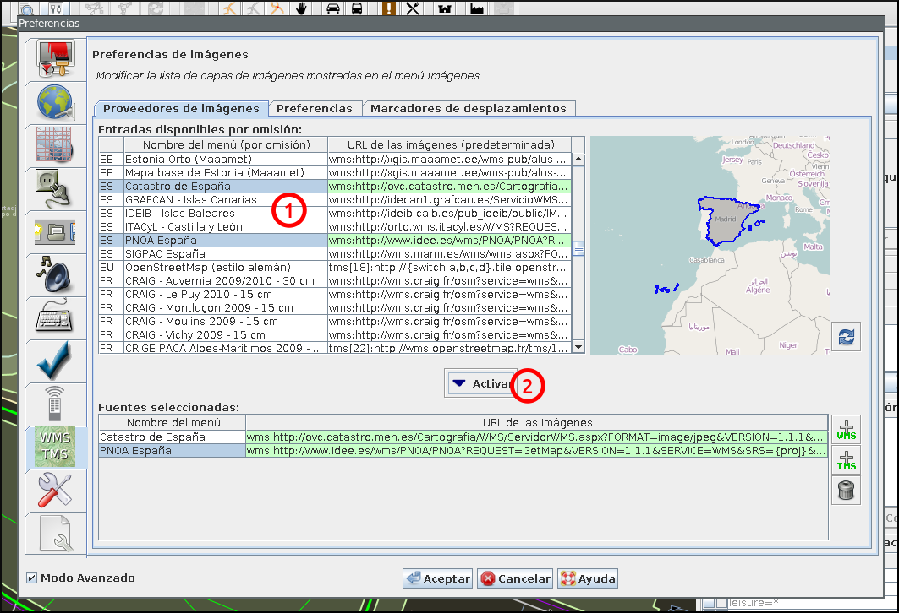
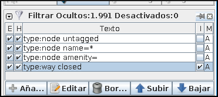
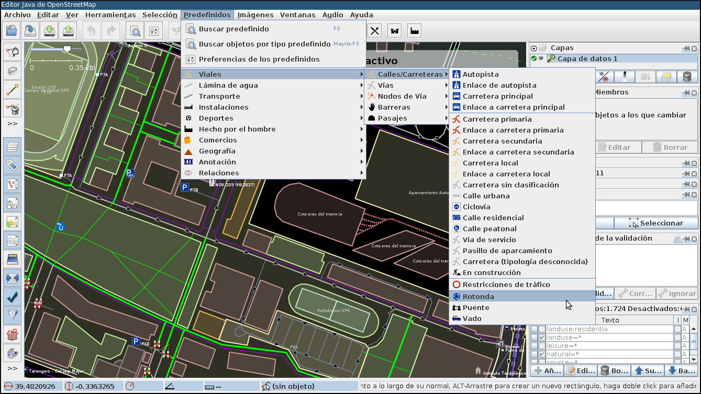
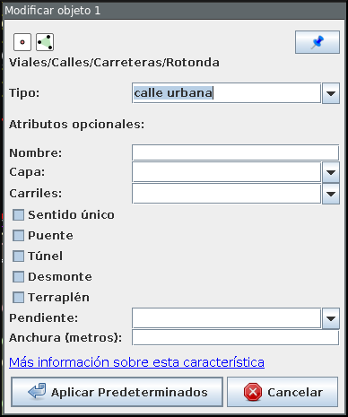
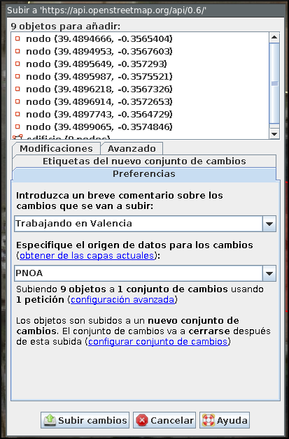

.. _tallerosmyjosm:

Taller de JOSM
====================

JOSM es el acrónimo de Java OpenStreetMap Editor, se trata de una aplicación
multiplataforma desarrollada por Immanuel Scholz y Frederik Ramm. Es el editor
preferido por la comunidad OSM, ya que tiene muchas funcionalidades
implementadas y permite editar gran cantidad de datos, aunque su curva de
aprendizaje puede resultar un poco pronunciada al inicio.

Una sesión de edición en JOSM suele incluir los siguientes pasos:

#. Carga de datos GPS o el uso de imágenes satélite u ortofotografías
#. Digitalización de información
#. Etiquetado de la información
#. Validación y subida de datos al servidor de OSM

.. important:: Durante la explicación del funcionamiento de JOSM el alumno puede
   trabajar con cualquier zona y experimentar en zonas sin datos para habituarse
   a la mecánica de trabajo de JOSM. Una vez revisado el funcionamiento de
   JOSM se propondrá un ejercicio práctico.

Instalación y arranque
--------------------------

La instalación de JOSM es muy sencilla, si tenemos una versión reciente de
Java probablemente sea tan fácil como ejecutar el enlace ``josm.jnlp`` de
la `web de JOSM <http://josm.openstreetmap.de/>`_. Este método utiliza una
característica llamada *Java Web Start*, y tiene la ventaja de que comprueba
al inicio si existe una versión más reciente de JOSM y se actualiza
automáticamente.

Si este método no funciona puedes descargarte de la misma web la versión actual
del enlace ``josm-tested.jar`` y hacer doble clic en el archivo descargado.

.. note:: Puedes consultar más documentación sobre la instalación y ejecución de JOSM
    en la sección `Running <http://josm.openstreetmap.de/wiki/InstallNotes#Running>`_
    de las notas de instalación de JOSM.

Crear un *script* de actualización y arranque en Linux
+++++++++++++++++++++++++++++++++++++++++++++++++++++++++

Si se utiliza un sistema Linux u OSX y no se dispone de soporte para *Java Web
Start* se puede crear un *script* como el siguiente para automatizar la
descarga de la versión más reciente de JOSM antes de ejecutarlo. Esto resulta
interesante porque JOSM se actualiza con mucha frecuencia.

El *script* sería el siguiente:

.. code-block:: bash

    #!/bin/bash

    cd /tmp
    wget -N http://josm.openstreetmap.de/josm-tested.jar
    java -jar josm-tested.jar

A este *script* bastaría con darle permisos de ejecución y ubicarlo en algún
lugar accesible. Al ejecutarlo comprobará si la versión de JOSM es la más reciente
y de no ser así la descargará. Después lanzará automáticamente el programa.

Cargar datos de referencia
-----------------------------

Carga de datos GNSS
+++++++++++++++++++++++++++++

JOSM permite cargar información obtenida a través de un receptor GNSS usando
para ello el formato de intercambio estandar GPX.

.. important:: Se recomienda encarecidamente no subir esta información directamente sin depurar
    o sin tratar, es preferible siempre usarla como base para digitalizar sobre ella
    y añadir los atributos correspondientes.

Cargar servicios de imágenes
+++++++++++++++++++++++++++++

Además de utilizar los datos recogidos en campo con GPS, notas, etc. se pueden
también usar imágenes en distintos formatos para usarlas como cartografía de
referencia y poder digitalizar sobre ellas.

En especial tienen significativa importancia dentro de JOSM la posibilidad de
cargar imágenes base provenientes de diversos proveedores a través de Internet
cuya información ya viene integrada en el propio JOSM o incluso se pueden
agregar nuevos como por ejemplo orígenes de datos WMS o TMS.  En España está
autorizado el uso del PNOA y del Catastro para digitalizar sobre las ortofotos
siempre que se identifiquen el origen y la resolución temporal con las
etiquetas ``source`` y ``sourcedate``.

Se puede acceder a la configuración de los proveedores a través del menú
:menuselection:`Editar --> Preferencias --> WMS/TMS`. Primero se busca el
proveedor a partir del código de país y una vez seleccionado se puede hacer
clic en el botón :guilabel:`Activar` y confirmar el diálogo.

Tras los cambios aparentemente nada habrá cambiado, pero ahora hay una nueva
entrada en el menú :menuselection:`Imágenes` y al pulsarla se cargará una
capa, debajo de la capa de datos actual, con la ortofotografía de la zona. Es
una capa que se puede activar o desactivar |btnverocul| , o cambiar la
transparencia |btntrans|.

Descarga de datos
------------------------------

JOSM trabaja por defecto con archivos de formato XML de OSM (archivos
:file:`.osm`). Para obtener un archivo de la zona con la que se quiere
trabajar hay que pulsar el botón de :guilabel:`Descarga` de datos del servidor
o desde el menú :menuselection:`Archivo --> Descargar desde OSM`. Al pulsar el
botón se muestra una interfaz donde se puede seleccionar la porción de datos
que quiere obtenerse.

.. note:: En este mapa se usan la rueda y los dos botones del ratón: el izquierdo
   para seleccionar la zona y la rueda y el derecho para desplazarse por el mapa.

El servidor limita las peticiones que cubran gran extensión para no colapsar el
servicio, pero si se requiere gran cantidad de datos se pueden realizar diversas
peticiones que acabarán almacenándose en un solo fichero.

Una vez seleccionada la zona y aceptada la petición por el servidor, JOSM
creará una capa que aparecerá en el panel superior del lado derecho.

Filtrando la información
----------------------------

Los filtros son una característica de JOSM que permite ocultar temporalmente
elementos cargados en pantalla para tener una mejor visibilidad del área de
trabajo descartando aquellos elementos que no nos interesen.

Antes de aplicar un filtro:

Tras aplicar el filtro:

Para definir nuevos filtros se utiliza el panel :guilabel:`Filtrar` que suele
encontrarse en la parte inferior del panel del lado derecho.

.. _josmfiltro:

   Filtros en JOSM

La sintaxis de los filtros es bastante sencilla y al *Añadir* uno nuevo se nos
muestra una pequeña guía con ejemplos. Los filtros que se muestran en la
figura :ref:`josmfiltro` realizan lo siguiente:

* Filtrar todos los nodos que no tengan etiqueta
* Filtrar todos los nodos que tengan la etiqueta *name* sea cual sea el valor
  de esta
* Filtrar todos los nodos que tengan la etiqueta *amenity*
  (otra forma de filtrar sin que importe el valor de la etiqueta)
* Filtrar todas las vías que **no** estén cerradas (usando el
  *check* para invertir la búsqueda)

Digitalizando
----------------------------

Para probar la digitalización crearemos una nueva capa en la que poder
trabajar sin modificar los datos que se han descargado, para crear la capa
usaremos el menú :menuselection:`File --> New Layer` o el atajo de teclado
:kbd:`Ctrl + N`.

.. note:: Al crear la nueva capa, la capa de datos anterior deja de ser la capa de datos
  activa y aparecerá como líneas de color negro. Es conveniente desactivar la
  capa para poder ver la ortofotografía, para ello seleccionaremos la capa y
  pulsaremos en botón de cambiar la visibilidad |btnverocul|.

.. note:: También es recomendable desactivar los filtros pulsando en la casilla `E`.

Para digitalizar un punto, haremos *zoom* sobre una zona con árboles, el
*zoom* se controla con la barra que hay arriba a la izquierda, pero también
con la rueda del ratón. A continuación pulsamos sobre el botón agregar
|btnagr| o pulsamos la tecla :kbd:`A` para entrar en el modo de edición.

Nodos
++++++++++

Digitalizamos los árboles poniendo un punto, haciendo un solo clic, sobre cada
copa de la ortofotografía. JOSM está pensado para añadir elementos lineales
por lo que por defecto espera tener que añadir líneas, para añadir tan solo
puntos deberemos pulsar la tecla :kbd:`Esc` después de hacer clic sobre cada
árbol.

.. note:: JOSM tiene **muchos atajos**. Si mantienes pulsada la tecla :kbd:`Shift`
    no es necesario pulsar la tecla :kbd:`Esc`, JOSM insertará nodos individuales.

De momento en realidad estamos simplemente poniendo los *Nodos*. Para que OSM
los reconozca como árboles deberíamos añadir también las *Etiquetas*, como
veremos más adelante.

Vías
++++++++++

Para digitalizar una vía, buscaremos un nivel de *zoom* que nos permita ver la
vía en su totalidad por lo menos una parte muy significativa de ella. Puede
que tengamos que desplazarnos por la imagen, pero como estamos en modo edición
si hacemos clic con el botón izquierdo añadiríamos un nuevo nodo. Para
**desplazarnos** sin salir del modo edición podemos conseguirlo haciendo clic
en el botón **derecho** del ratón y movernos por el mapa sin soltarlo.

Para digitalizar la vía vamos marcando nodos de manera consecutiva intentando
seguir el eje de esta y respetar la forma siguiéndola sobre la ortofotografía.
Es interesante que además pongamos un nodo en cada intersección que tenga la
vía, lo que facilitará digitalizar las vías que conectan con ésta más
adelante.

Un par de atajos de teclado útiles a la hora de digitalizar vías:

- Pulsar la tecla :kbd:`Alt` mientras digitalizas vías, te permite hacer
  que el próximo nodo, aunque esté conectado al nodo anterior, forme una vía nueva.

- Cuando tenemos una vía seleccionada (también funciona con vías cerradas)
  tener la tecla :kbd:`Shipt + Ctrl` pulsada te permite rotar el elemento seleccionado.

- Si pulsamos :kbd:`Ctrl + Alt` podremos cambiar la escala del elemento seleccionada.

- Por último, si mientras digitalizamos hacemos clic con el ratón en el ángulo de la barra
  inferior (el cuarto elemento) activaremos el modo de ayuda de dibujado de geometrías
  que nos asiste con ángulos establecidos e intersecciones.

Áreas
++++++++++

Las áreas no son más que una vía que empieza y acaba en el mismo punto y tiene una etiqueta que la identifica.

En este ejemplo, digitalizaremos el área de aparcamiento que hay en la zona en
la que estamos trabajando, teniendo en cuenta que deberemos cerrar la vía
pulsando al final sobre el primer nodo que digitalicemos.

Los edificios son seguramente el caso más típico de áreas a digitalizar.

El *plugin* ``building tools``
~~~~~~~~~~~~~~~~~~~~~~~~~~~~~~~~~~

Al activar este plugin se nos muestra un nuevo modo en la barra de
herramientas. Este modo permite dibujar edificios de forma muy eficiente al
evitar dibujar todos los nodos del mismo. Está pensado para dibujar edificios
que tienen una forma rectangular.

Si una vez dibujado el primer edificio lo seleccionamos, los siguientes
edificios se crean orientados en la misma dirección, teniendo únicamente que
marcar las esquinas opuestas del mismo.

La herramienta ``Crear áreas``
~~~~~~~~~~~~~~~~~~~~~~~~~~~~~~~~

Existen diversas herramientas que permiten manipular las geometrías, una de
las más interesantes (especialmente combinada con la anterior) es la de
``Crear áreas``. Esta herramienta permite mover una sección de un área hacia
fuera o dentro en paralelo a la dirección existente. En la figura
:ref:`retranqueo` se muestra el proceso.

1. Dibujar un edificio con el modo ``Edificio`` (en este caso sobre la terraza)
2. Dibujar los puntos de corte de la zona de la fachada a desplazar
3. Mediante la herrameinta ``Crear áreas`` llevar meter la fachada hacia dentro
4. Mover el edificio a su ubicación en la parte inferior

.. _retranqueo:

   Dibujar un edificio ortogonal

Añadiendo etiquetas
----------------------------

.. note:: Para el siguiente paso es preferible desactivar la capa del PNOA
   seleccionándola y pulsando el botón correspondiente |btnverocul|.

Seleccionaremos el primer árbol que hemos digitalizado para lo que hay que
entrar en modo selección pulsando el botón selección |btnsel| o la tecla
:kbd:`S` y hacemos clic sobre uno de los nodos que representan a los árboles,
puede que tengamos que hacer un poco de *zoom*.

Una vez seleccionado, pulsamos el botón :kbd:`Add` de la ventana
:guilabel:`Properties/Memberships` para poder añadir las Etiquetas
correspondientes.

¿Qué etiquetas se emplean para indicar que es un árbol?
+++++++++++++++++++++++++++++++++++++++++++++++++++++++++++++

Lo mejor **SIEMPRE** es consultar la wiki de OSM donde tienen un
`listado de elementos comunes en los mapas Map Features en español <http://wiki.openstreetmap.org/wiki/ES:Map_Features>`_
y cómo emplearlos. En este caso buscaremos la entrada de árbol en
la página y vemos que se corresponde con el par clave/valor ``natural/tree``.

Pero además si pulsamos sobre la palabra
`tree <http://wiki.openstreetmap.org/wiki/Tag:natural%3Dtree>`_
nos lleva a la entrada específica de la wiki en la que explican las
características a tener en cuenta y generalmente se detallan las
claves a las que también suelen estar asociadas las entidades a
cartografiar e incluso ejemplos.

En definitiva, los árboles suelen etiquetarse usando las siguientes claves:

* *natural* con el valor *tree*
* *name*
* *type*
* *height*
* *name:botanical*

Pueden asignarse etiquetas a grupos de elementos, para lo que primero hay que
seleccionarlos manteniendo pulsada la tecla *Mayúsculas* mientras se va
haciendo clic; para posteriormente aplicar la etiqueta, según el procedimiento
ya visto.

También pueden *copiarse* etiquetas entre elementos, seleccionamos el elemento
que tiene las etiquetas y lo copiamos con :kbd:`Ctrl + C` y después seleccionamos
el elemento destino y pulsamos :kbd:`Ctrl + Shift + V` y le asignará
automáticamente las etiquetas del primer elemento.

Ahora hay que proceder igual con los demás elementos de nuestro dibujo, tales como
`carreteras <http://wiki.openstreetmap.org/wiki/Tag:highway%3Dresidential>`_,
`parkings <http://wiki.openstreetmap.org/wiki/Tag:amenity%3Dparking>`_,
`edificios <http://wiki.openstreetmap.org/wiki/Key:building>`_, etc...

.. note:: El *plugin* ``building tools`` ya inserta la etiqueta de edificio por
   nosotros.

Consultaremos los elementos en su página correspondiente y  añadiremos las
etiquetas que creamos sean necesarias para describir la realidad. El resultado
tras aplicar las etiquetas podría ser parecido a este:

Añadir etiquetas predefinidas
++++++++++++++++++++++++++++++++++

Añadir las etiquetas una a una es muy costoso. En lugar de hacerlo de esta
forma, JOSM ofrece todo un conjunto de diálogos predefinidos para los tipos de
datos más comunes. Para ello una vez añadida o seleccionada la geometría (vía
o nodo) podemos usar la entrada de menú :menuselection:`Predefinidos` y
navegar por los diferentes tipos de datos. Por ejemplo para dar de alta una
rotonda podemos navegar a
:menuselection:`Predefinidos --> Viales --> Calles/Carreteras --> Rotonda`.

Si ya sabemos cómo se identificia un elemento en el menú, resulta muy cómodo
usar el buscador que se lanza con la tecla :kbd:`F3`. Por lo tanto, basta con
empezar a escribir ``Rotonda`` para que el buscador encuentre nuestra etiqueta.

De cualquiera de estas dos formas, al final llegaremos a un diálogo que ofrece
una interfaz para añadir las etiquetas más comunes referidas al tipo
seleccionado, usando listas para elegir las opciones más habituales, botones
de tipo *check* para indicar características que solo toman un valor e incluso
disponemos de un enlace a la documentación ampliada en el wiki del proyecto y
un botón que nos permite *«anclar»* el elemento a la barra de herramientas en
caso de que vayamos a usar mucho este tipo de elemento.

Especificar las fuentes
++++++++++++++++++++++++++

Es muy importante identificar los orígenes de datos de la información, ya que
es una de las formas de medir la calidad de los datos que almacena OSM.

En España, si se digitalizan datos sobre la ortofotografía del PNOA hay que
añadir a **TODOS** los elementos digitalizados el par clave valor
*source*/*PNOA* y a ser posible la clave *source:date* cuyo valor corresponde
con la fecha en la que se realizó el vuelo

Otros posibles orígenes de datos válidos para usar en España se pueden encontrar
listados en la página web
`Spain Datasources <http://wiki.openstreetmap.org/wiki/Spain_Potential_Datasources>`_
de la wiki de OpenStreetMap.

Consejos generales sobre digitalización y etiquetado
-------------------------------------------------------

Acude SIEMPRE a la documentación y los expertos
    En caso de duda es mejor consultar la wiki primero y si no se
    encuentra la respuesta acudir a las
    `lista de correo en español de OpenStreetMap <http://lists.openstreetmap.org/listinfo/talk-es>`_

*Don't map for the render*
    O lo que es lo mismo, en general y excepto en muy contadas
    excepciones, no hay que dibujar y etiquetar las cosas «para
    que queden bonito en el mapa», se debe dibujar y etiquetar
    *la realidad* o la mejor representación de ella que se pueda
    conseguir.

No reinventar la rueda
    Hay mucho planeta cartografiado en OpenStreetMap, posiblemente
    alguien ya haya solucionado el problema de representación de
    la realidad que se te presenta, muchas veces se aprende más
    intentando ver cómo han resuelto otros problemas similares,
    busca sitios donde ocurran los mismos fenómenos que quieras
    representar y mira como lo han hecho otros.

*Plugins* de JOSM
---------------------

JOSM es un *software* en constante evolución. Una de sus características más
interesantes es la capacidad para ampliar su funcionalidad utilizando
extensiones (conocidos como *plugins*). Se puede acceder a la lista de
*plugins* desde el diágolo de preferencias en :menuselection:`Editar --> Preferencias`
o pulsando :kbd:`F12`. En este diálogo accedemos a la lista de *plugins* desde
la cuarta sección. La primera vez habrá que descargar la lista de extensiones
disponibles.

Algunos *plugins* interesantes son:

- `building tools <http://wiki.openstreetmap.org/wiki/JOSM/Plugins/BuildingsTools>`_:
  añade herramientas para crear edificios de forma muy eficiente
- `imagery offset db <http://wiki.openstreetmap.org/wiki/Imagery_Offset_Database>`_:
  ofrece una base de datos de correcciones de imágenes que
  están desplazadas de su ubicación correcta
- `notes <http://wiki.openstreetmap.org/wiki/JOSM/Plugins/Notes>`_: añade la
  capa de notas de la web de OSM
- `utils plugin 2 <https://wiki.openstreetmap.org/wiki/JOSM/Plugins/utilsplugin2>`_:
  añade una gran cantidad de nuevas herramientas tanto para la selección como
  para la creación de entidades.

Guardando el archivo
----------------------------

Puede ser interesante guardar la capa que estamos editando para usarla con
otras  herramientas que veremos en el curso. Para guardar la capa que estamos
editando pulsaremos con el botón derecho del ratón sobre el nombre de la capa
y seleccionaremos la opción :guilabel:`Save as...` lo que nos permitirá
guardar la información en formato :file:`.osm` que es el formato XML de
OpenStreetMap.

Subir al servidor
--------------------------

Por último, si la cartografía fuese de interés para el proyecto, es posible
subir los cambios seleccionando la opción de menú
:menuselection:`Archivo --> Subir cambios`. Para poder subir los cambios
previamente habrá que introducir las credenciales del usuario del proyecto
en el diálogo de preferencias.

Para subir los cambios hay además que indicar un texto que describa el trabajo
realizado y es también muy conveniente indicar en el diálogo el origen de los
datos que se han usado como referencia.

Ejercicio
----------------------------

Como ejercicio se propone que cada alumno del curso elija alguna de las zonas
propuestas y haga una sesión de edición que mejore la cartografía de la zona.
Las zonas seleccionadas son pequeños municipios de la Comunidad Valenciana que
están pobremente cartografiados por lo que cualquier contribución realizada
por el alumno será de ayuda. Por supuesto, el alumno es libre de elegir
cualquier otra zona de OSM siempre que le permita practicar con la creación de
nuevas geometrías, añadir etiquetas, etc.

Se recomiendan las siguientes tareas:

- Dar de alta calles y edificios públicos relevantes (colegios, equipamientos, etc.)
- Dar de alta zonas de uso del suelo: residencial, industrial, parques
- Dar de alta puntos de interés: farmacias, bancos,...
- Revisar nombres y sentidos de las vías

.. note:: Aunque se darán unos datos de partida nuevos para las siguientes
   secciones del curso, los datos editados podrían usarse como
   extensión si el alumno así lo desea.

.. botones

