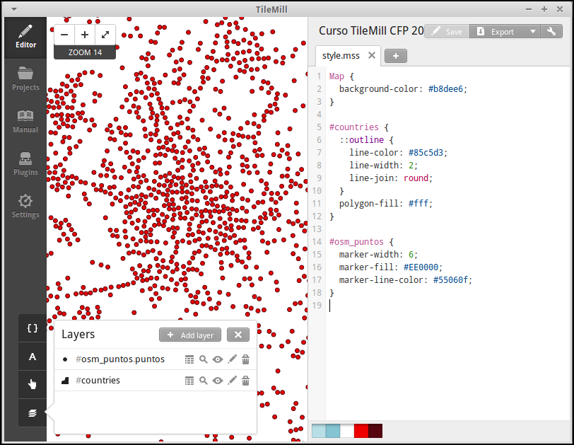
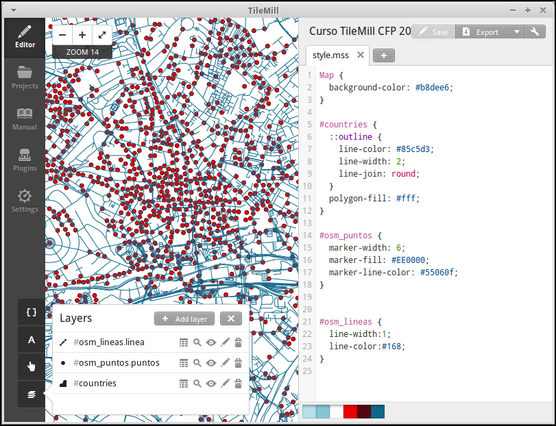
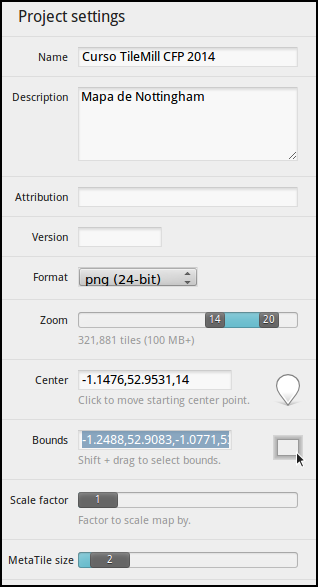
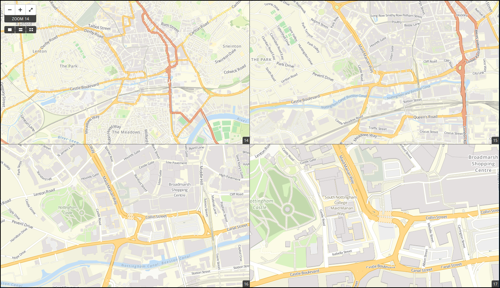

.. _tallertilemill:

TileMill, el estudio cartográfico
====================================

TileMill_ es un herramienta que permite un acercamiento al diseño cartográfico
a través de un lenguaje que es familiar a los desarrolladores web. Se trata de
un producto de escritorio (aunque se puede ejecutar para acceder vía *web*).
El objetivo de TileMill es diseñar cartografía de la forma más sencilla y
atractiva posible generando como productos finales diferentes visualizaciones,
tal y como se verá más adelante.

TilMill es *software* libre, está desarrollado por Mapbox_ y el código fuente
está disponible en su `repo en GitHub <https://github.com/mapbox/tilemill>`_.


.. _TileMill: http://www.mapbox.com/tilemill/
.. _Mapbox: http://www.mapbox.com


Iniciando TileMill
----------------------------

.. note:: Este taller está diseñado para ejecutarse en OSGeo Live 7.0

Arrancamos TileMill seleccionando la opción del menú
:menuselection:`Geospatial --> Spatial Tools --> TileMill`

Secciones
--------------

La interfaz de TileMill dispone de las siguientes secciones:

*Editor*:
  Es el espacio de trabajo del estudio, donde se cargan datos y se
  a estilo a la cartografía.
*Projects*:
  Espacio para administrar los proyectos que tenemos cargados en TileMill.
  Solo podemos tener cargado un proyecto cada vez en el editor.
*Manual*:
  Documentación integrada con diversos apartados sobre cómo funciona
  TileMill.
*Plugins*:
  Sección para activar funcionalidad adicional de TileMill.
*Settings*:
  Configuracioń general de TileMill.

Creando el proyecto
-------------------------------

TileMill carga por defecto la pestaña de :menuselection:`Projects` y en ella
tenemos el botón :menuselection:`+ New Project` que pulsaremos definir
nuestro proyecto.


Nos muestra la ventana de información del proyecto en la que deberemos
introducir los datos básicos que lo identifiquen.


**Filename**
    cfp2014

**Name**
    Curso TileMill CFP 2014

**Description**
    Mapa de Nottingham

**File format**
    PNG 24

**Default data**
    Dejar marcado

Y pulsamos el botón :menuselection:`Add`

Al abrir el proyecto, pulsando sobre el en la pestaña
:menuselection:`Projects` vemos que se han cargado una capa de países por
defecto y que tiene un nivel de visualización bastante alto.

Añadiendo datos
------------------

El primer paso siempre es añadir datos y el primer paso para añadirlos es
tener claros sus metadatos, en especial:

* Su Formato
* Su Tamaño
* y su Sistema de referencia

Formatos vectoriales admitidos
``````````````````````````````````````

* CSV
* Shapefile
* KML
* GeoJSON

Formatos raster admitidos
``````````````````````````````````````

* GeoTIFF

Bases de datos admitidas
``````````````````````````````````````

* SQLite
* PostGIS


Introducción al lenguaje CartoCSS
----------------------------------

CartoCSS_ es el lenguaje que utiliza TileMill para aplicar estilos a las
primitivas cartográficas. Está basado en *Cascadenik* que es un
pre-procesador de estilos más antiguo. CartoCSS_ utiliza la
biblioteca de renderizado de cartografía Mapnik_, otro excelente
componente de *software libre*.

Mapnik_ se configura directamente mediante ficheros XML, pero poca gente
entiende XML así que hace un tiempo que aparecieron estas herramientas
que generan su XML a partir de un lenguaje más sencillo y expresivo, en
definitiva para hacer «la vida más fácil» a los usuarios de Mapnik_.

TileMill usa Mapnik_ por debajo y CartoCSS_ es el lenguaje con el que
le comunica cómo deben quedar las cosas.

.. _CartoCSS: https://www.mapbox.com/tilemill/docs/manual/carto/
.. _Mapnik: http://www.mapnik.org/

Pintando puntos
```````````````````

.. code-block:: css

    #osm_puntos {
      marker-width: 6;
      marker-fill: #EE0000;
      marker-line-color: #55060f;
    }


Existen dos tipos de *puntos* **Point** y **Marker** entre los dos suman 30
propiedades.



Pintando lineas
```````````````````

.. code-block:: css

  #osm_lineas {
    line-width:1;
    line-color:#168;
  }

Existen 19 propiedades distintas para las ĺíneas.



Pintando áreas
````````````````
.. code-block:: css

  #osm_buildings {
      line-color: darken(#ccc,40%);
      line-width: 2;
      polygon-opacity: 1;
      polygon-fill: #ccc;
  }

Existen 5 propiedades distintas para las áreas.

.. image:: ../img/ejemploarea.png
   :width: 600 px
   :alt: ejemplo con áreas dibujadas
   :align: center


.. _pintandoconclase:

Pintando con clase
```````````````````````

También se pueden usar clases y condiciones para filtrar las propiedades por
atributos o por el nivel de **zoom** en el que nos encontremos. Finalmente los
selectores se pueden anidar para compartir propiedades.

En el ejemplo siguiente se seleccionan todos los puntos de la capa
``osm_puntos`` que tengan algún dato en el campo ``tourism`` (pidiendo que sea
distinto a la cadena de texto vacía) y se aplicará solo a partir del nivel de
*zoom* 14. En ese selector se establecen unas propiedades generales de tamaño
y color del borde y a continuación se anidan selectores por cada una de las
clases a renderizar estableciendo solo la propiedad que va a cambiar, es decir,
el color del símbolo.

.. code-block:: css

    #osm_puntos[tourism!=""][zoom>13]{
        /** propiedades generales **/
        marker-width: 8;
        marker-line-color: #000;

        /** temático por tipo de turismo **/
        [tourism="artwork"]{
          marker-fill: #a6cee3;
        }
        [tourism="attraction"]{
          marker-fill: #1f78b4;
        }
        [tourism="gallery"]{
          marker-fill: #b2df8a;
        }
        [tourism="hostel"]{
          marker-fill: #33a02c;
        }
        [tourism="museum"]{
          marker-fill: #e31a1c;
        }
    }


.. image:: ../img/ejemplo-clases.png
   :width: 600 px
   :alt: ejemplo con clases
   :align: center


Y alguna cosilla más
```````````````````````

El uso de **@** te permite definir **variables**

.. code-block:: css

  /** colores para agua y bosque**/
  @water : #c0d8ff;
  @forest: #cea;

  /** estilos para usos del suelo
      de para agua y bosque **/
  #landusage{
      /* características generales */
      line-color: darken(#ccc,40%);
      line-width: 2;
      polygon-opacity: 1;

      [type="water"]{
        polygon-fill: @water;
      }
      [type="wood"]{
        polygon-fill: @forest;
      }
  }


Y existen funciones para operar sobre los colores para aclararlos, oscurecerlos, etc. (`referencia de color <https://www.mapbox.com/carto/api/2.3.0/#color>`_) :

.. code-block:: css

  @border-water: darken(@water,50%);


Taller
--------------

En las siguientes secciones se espera que el alumno repita las acciones
propuestas para cargar los distintos tipos de datos soportados por TileMill
y aplicando estilos similares a los indicados.

Añadiendo una capa de puntos
``````````````````````````````

Procederemos ahora a añadir nuestra primera capa de puntos, para lo que
desplegaremos el menú de capas pulsando en el botón |btnmenucapas| y
seleccionamos :menuselection:`+ Add layer`


En la ventana que aparece seleccionaremos la opción de
:menuselection:`PostGIS` y rellenamos los campos como se indica.


**ID**
    osm_puntos

**Class**
    puntos

**Connection**
    dbname=osm_local host=localhost port=5432 user=user password=user

**Table or subquery**
    planet_osm_point

**Unique key field**
    osm_id

**Geometry field**
    way

**SRS**
    Seleccionamos ``WGS84``

Y pulsamos :menuselection:`Save & Style` para que añada los datos con un estilo por defecto.

Veremos como inmediatamente aparece un punto en la zona de Inglaterra.


Corrigiendo la visualización por defecto
^^^^^^^^^^^^^^^^^^^^^^^^^^^^^^^^^^^^^^^^^^^^^^^^^^


En realidad nuestra zona de trabajo es bastante más pequeña que la que
muestra por defecto TileMill, por lo que modificaremos las preferencias para
que muestre por defecto una zona más ajustada a nuestro juego de datos. Para
ello pulsaremos en el botón de configuración del proyecto |btnconfigprj| y
lo configuramos de la siguiente forma:

Zoom
    Desplazar las barras para que los niveles de zoom estén entre 12 y 20

Center
   -1.1476,52.9531,12

Bounds
   -1.2488, 52.9083, -1.0771, 53.0076




Añadiendo elementos lineales
``````````````````````````````

Para representar las calles utilizaremos una de las *ayudas* que proporciona
ImpOSM; como ya hemos dicho, por defecto separa las vías en varias tablas,
pero también crea una vista de PostGIS que aglutina toda la información
relativa a estas.

Añadiremos una nueva capa de PostGIS que lea la información de la tabla
``osm_roads`` y añadiremos una entrada para cada tipo de vía.

* footway
* living_street
* path
* pedestrian
* residential
* service
* steps
* track

Para obtener todos los distintos tipos de vía podemos usar emplearemos
`pgAdmin III` donde podemos lanzar la *query*:

.. code-block:: sql

    SELECT DISTINCT type FROM osm_roads;

Para representarlo usaremos el código siguiente:

.. code-block:: css

    #calles_lineas {
        line-width:1;

        [type = 'footway'], [type = 'pedestrian'] {
              line-color:#f2f974;
        }
        [type = 'residential'],[type = 'living_street'],
        [type = 'service']  {
              line-color:#aaa;
        }
        [type = 'steps'] {
              line-color:#7cc7fd;
        }
        [type = 'path'], [type = 'track'] {
              line-color:#ff9f3b;
        }
    }

Añadiendo los edificios
``````````````````````````````

Añadiremos ahora los edificios, que están en la tabla `osm_buildings`.

.. code-block:: css

    #edificios {
      line-color:#a71b62;
      line-width:0.5;
      polygon-opacity:1;
      polygon-fill:#d86ebb;
    }

Orden de las capas
``````````````````````````````

El orden de renderizado de las capas es el orden en el que aparecen en el
gestor de capas |btnmenucapas|, para cambiar el orden basta pulsar en el
indicador del tipo de capa (puntos, líneas y áreas) que hay junto al nombre
y arrastrar hacia arriba o hacia abajo la capa.

Añadiendo etiquetas
``````````````````````````````


Por último, añadiremos los nombres de las calles, para lo cual primero
tenemos que definir una variable, preferentemente al principio de todas las
definiciones, que tenga el nombre de la fuente y las posibles fuentes
sustitutas si la fuente no está instalada en el sistema.

.. code-block:: css

    @futura_med: "Futura Medium","Function Pro Medium","Ubuntu Regular","Trebuchet MS Regular","DejaVu Sans Book";

TileMill incorpora un gestor de fuentes que nos permite ver qué fuentes hay
instaladas en el sistema al que se accede empleando el botón de fuentes
|btnfuentes|, las fuentes instaladas aparecen en **negrita** y el gestor nos
permite copiar y pegar literalmente el nombre de la fuente.

Aunque la capa de calles ya tiene el campo `name` que es el que vamos a
utilizar, es siempre muy recomendable volver a añadir la capa y usarla
exclusivamente para las etiquetas. En este caso rellenaremos los campos con
los siguientes datos:

ID
  calles_nombres

Class
  nombres

Connection
  dbname=osm host=localhost port=5432 user=osm password=osm

Table or subquery
  (SELECT * FROM osm_roads WHERE name IS NOT NULL) AS foo

Unique key field
  osm_id

Geometry field
  geometry

En esta ocasión en vez de la tabla, hemos usado una subconsulta, de forma
que solo carguemos en memoria las entidades que tengan algún valor en el
campo `name`. A las subconsultas hay que añadirles un alias para que
TileMill las reconozca.

TileMill habrá asignado a la capa un estilo por defecto para capas de
líneas, aunque nosotros lo vamos a modificar para que represente textos:

.. code-block:: css

   #calles_nombres {
       text-name: "[name]";
       text-face-name: @futura_med;
       text-placement: line;
   }


Estos son los elementos mínimos para que una etiqueta aparezca en TileMill,
aunque si vamos a la ayuda del programa |btnayudainline| y vemos la sección
`text` veremos que las etiquetas tienen 30 opciones de configuración
distintas.


Más sobre el lenguaje CartoCSS
-------------------------------------

Usando iconos como marcadores
`````````````````````````````````

Por ejemplo para pintar puntos de interes

.. code-block:: css

  .amenity.place[zoom=15] {
    [type='police']{
      point-file: url(../res/comi-9px.png);
    }
    [type='fuel'] {
      point-file: url(../res/petrol-9px.png);
    }
    [type='townhall'],
    [type='university'] {
      point-file: url(../res/poi-9px.png);
    }
  }


Pintando cajas de carretera
```````````````````````````````

.. code-block:: css

  .highway[TYPE='motorway'] {
    .line[zoom>=7]  {
      line-color:spin(darken(@motorway,36),-10);
      line-cap:round;
      line-join:round;
    }
    .fill[zoom>=10] {
      line-color:@motorway;
      line-cap:round;
      line-join:round;
    }
  }

  .highway[zoom=13] {
    .line[TYPE='motorway']      { line-width: 2.0 + 2; }
    .fill[TYPE='motorway']      { line-width: 2.0; }
  }


Ejercicio
---------------------------

Como ejercicio del taller se propone incorporar al mapa los contenidos de
las tablas `osm_arboles` y `osm_landusages`.

Extra: OSM-Bright
---------------------------

Recientemente Mapbox ha publicado un ejemplo completo de representación de
datos de OSM empleando TileMill.

Si queremos ver como quedaría nuestro juego de datos con este estilo
deberemos cerrar TileMill y en una consola de sistema escribir lo siguiente:

.. code-block:: bash

    $ cd ../datos/mapbox-osm-bright/
    $ ./make.py
    $ cd ../..
    $ imposm --read UniversitatGirona.osm --write --database osm --host localhost --user osm --optimize --overwrite-cache --deploy-production-tables -m /home/jornadas/taller_osm_tilemill/datos/mapbox-osm-bright/imposm-mapping.py

Si volvemos a abrir TileMill veremos que se ahora existe un proyecto nuevo
llamado `OSM Bright Universitat de Girona` y tras abrirlo, teniendo en
cuenta que puede tardar un poco mientras comprueba las capas,

En el ejemplo proporcionado por Mapbox se puede ver como se representan
muchos elementos y como condicionar la visualización usando niveles de zoom.



Exportando los mapas
---------------------------

* PNG
* PDF
* MBTiles
* SVG

Montando un TMS
`````````````````````

Pasar de MBTiles a una estructura de directorios para TMS `usando mbutil
<https://github.com/mapbox/mbutil>`_

.. code-block:: bash

   $ mb-util exportado.mbtiles directorio/

Otras alimañas
---------------

Soporte para plugins
```````````````````````````

A partir de la versión 0.9 y aprovechando que node.js también lo permite.

Añaden funcionalidades como poder ver varios niveles de zoom a la vez.

A fecha de hoy hay 5 plugins *Core* y 2 plugins adicionales.

Mapas interactivos
```````````````````````````

TileMill admite cierta interactividad que se puede configurar para cada mapa.


Referencias y enlaces
---------------------------
* `Página principal de TileMill <http://mapbox.com/TileMill/>`_
* `Referencia del lenguaje CartoCSS <http://mapbox.com/carto/>`_
* `Estilo OSM Bright de Mapbox para cartografía de OpenStreetMap <https://github.com/mapbox/osm-bright>`_

